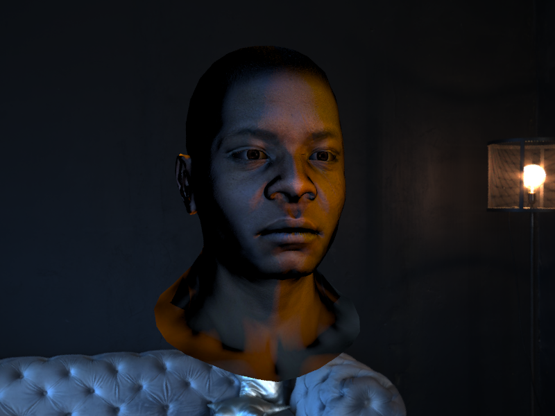
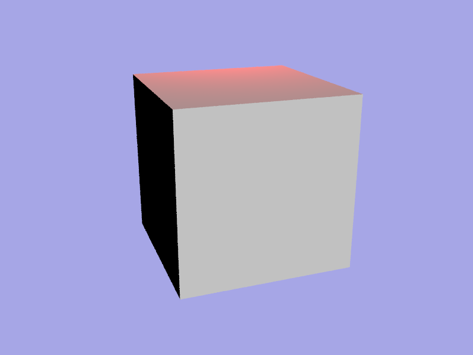
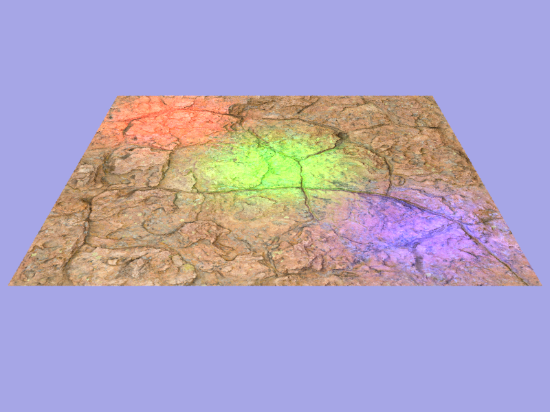
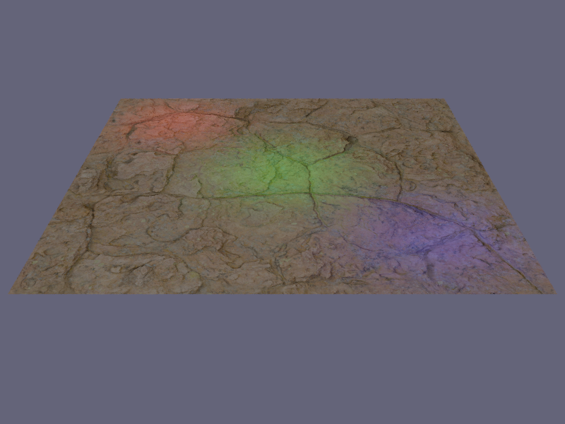
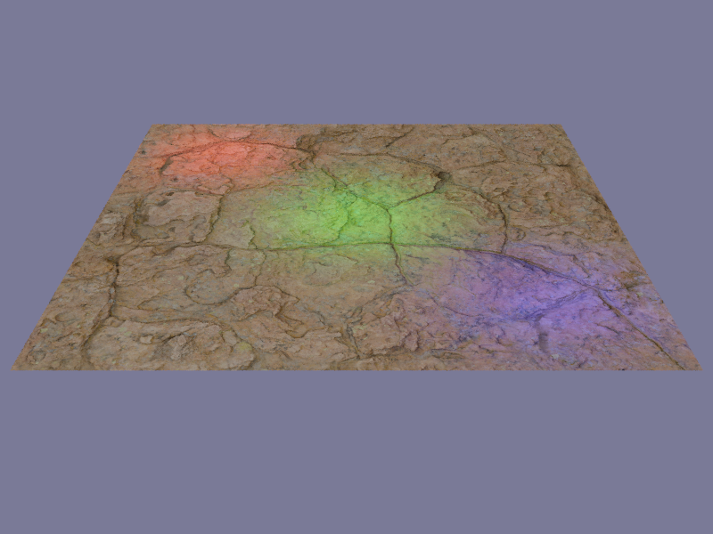
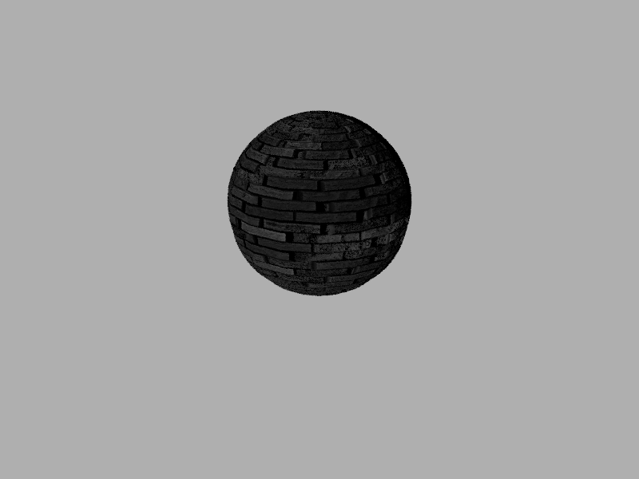

# Lumen

**Lumen** is a modular, modern C++20 3D rendering engine designed to demonstrate advanced software engineering practices and 3D graphics programming.  
It serves as a testament to my proficiency in building scalable, maintainable, and high-performance rendering systems.



## ✨ Features

- **Texturing:** Supports albedo and normal mapping, with configurable wrapping (`REPEAT`, `MIRROR_REPEAT`, `CLAMP_TO_EDGE`, `CLAMP_TO_BORDER`) and filtering (`BILINEAR`, `NEAREST`) modes
- **Modular Architecture:** Clean separation of concerns across modules like `Core`, `Scene`, `Geometry`, `Lighting`, `Rendering`, and `Export`
- **Mesh Generation & Loading:** Procedural generation of cubes, spheres, and planes, along with OBJ file loading capabilities
- **Advanced Lighting:** Implements directional, point, and spot lights with customizable parameters
- **Camera System:** Configurable camera with aperture, focus distance, field of view, and transformation controls
- **Skybox Integration:** Supports environment mapping using skybox textures
- **Image Exporting:** Renders can be exported as PNG images with tone mapping and exposure adjustments
- **Comprehensive CI:** Automated formatting, linting and testing via GitHub Actions

## 🧱 Architecture Overview

The project is structured into distinct modules to ensure maintainability and scalability:

- **Core:** Fundamental utilities and data structures
- **Surface:** Manages materials and textures
- **Geometry:** Responsible for mesh creation and loading
- **Lighting:** Defines different light types and their behaviors
- **Scene:** Manages objects, camera, lights, and the skybox
- **Rendering:** Handles the rendering pipeline and settings
- **Export:** Manages the export of rendered images
- **ImplementationParameters:** Handles configurable parameters required by specific rendering strategies. For example, the Exposure tone mapping requires parameters like exposure level, while others like Reinhard do not. This module provides a clean interface for managing such parameters and will integrate well with future UI components

This modular design facilitates independent development and testing of each component, promoting clean code practices and ease of maintenance.

## 📖 Documentation

The project is available with a Doxygen documentation. The documentation has been deployed with GitHub Pages and is avvessible from this link : [https://lucas-gtr.github.io/Lumen/](https://lucas-gtr.github.io/Lumen/).

It includes detailed class references and module overviews.

## 🔬 Rendering Pipeline

- **Ray Sampling**: Rendering uses a Monte Carlo approach. For each pixel, several rays are sampled using stratified sampling within a grid, ensuring uniform stochastic coverage across the pixel area. This improves convergence and reduces noise in the output.
- **Flexible Sample Count**: The number of rays per pixel (render samples) is configurable, allowing a trade-off between quality and performance
- **No Indirect Lighting:** Currently, no global illumination or path tracing is implemented.
- **Tone Mapping:** Final color output can be mapped using Reinhard or Exposure techniques, or simply clamped for raw output.
- **Color Accuracy:** All lighting computations are performed in linear space, with gamma correction applied when writing to sRGB.

## 🛠️ Build & Run Instructions

### Prerequisites

- C++20 compatible compiler (e.g., GCC 10+, Clang 11+, MSVC 2019+)
- CMake 3.10 or higher
- Eigen library (included as a submodule)

### Building the Project

```bash
git clone --recurse-submodules https://github.com/lucas-gtr/Lumen.git
cd Lumen
mkdir build && cd build
cmake ..
make
```

### Optional Build Flags
- `ENABLE_COMPILE_WARNINGS`: Enable compiler warnings (default: ON)
- `ENABLE_SANITIZERS`: Enable address and undefined behavior sanitizers (default: ON)
- `ENABLE_COMPILER_OPTIMIZATIONS`: Enable compiler optimizations (default: ON)
- `ENABLE_LTO`: Enable Link Time Optimization (default: OFF)
- `ENABLE_CLANG_FORMAT`: Enable code formatting checks (default: OFF)
- `ENABLE_CLANG_TIDY`: Enable static analysis checks (default: OFF)
- `ENABLE_DOXYGEN`: Generate documentation using Doxygen (default: OFF)
- `ENABLE_TESTS`: Build and run unit tests (default: OFF)

### Running the Application
```bash
make run
```

This will execute the Lumen application, rendering the scene as defined in `main.cpp` and exporting the resulting image to the Gallery directory.

## 🖼️ Example Usage
The `main.cpp` file demonstrates how to:
- Create various meshes (triangle, cube, sphere, plane)
- Load an OBJ model with associated textures
- Set up materials with albedo and normal maps
- Configure a camera with specific parameters
- Add different types of lights to the scene
- Render the scene and export the image

## ✅ Continuous Integration
The project employs GitHub Actions for continuous integration, ensuring code quality and reliability through automated workflows:

- Formatting & Linting: Utilizes clang-format and clang-tidy to enforce code style and detect potential issues.
- Testing: Runs unit tests using GoogleTest to validate functionality.

These workflows are triggered on pull requests to the `main` branch, maintaining code integrity and facilitating collaborative development.

### 🧪 Testing & Coverage
Unit tests are located in the tests/ directory and can be executed as follows:

```bash
make run-tests
```

To generate a coverage report:

```bash
make coverage
make update-readme
```

This will produce a coverage report and inject a summary into the README.md between the designated markers :

### Code Coverage summary

<!-- COVERAGE-START -->

| Metric    | Coverage |
|-----------|----------|
| Functions | 100.00% (273/273) |
| Lines     | 99.90% (1100/1101) |

<!-- COVERAGE-END -->

The full details of the coverage report are available [here](https://html-preview.github.io/?url=https://github.com/lucas-gtr/Lumen/blob/main/tests/coverage_report/coverage_report.html)

## Commands

These are the available Make targets:

| Command               | Description                                                                 |
|-----------------------|-----------------------------------------------------------------------------|
| `make run`            | Build and run the Lumen application                                         |
| `make build`          | Build the project if configured                                             |
| `make configure`      | Configure the main development build environment                            |
| `make format`         | Run clang-format over the entire codebase                                   |
| `make lint`           | Run static analysis using clang-tidy                                        |
| `make format-and-lint`| Run both clang-format and clang-tidy checks                                 |
| `make configure-tests`| Set up the build environment for unit tests                                 |
| `make run-tests`      | Build and run the test suite using GoogleTest                               |
| `make coverage`       | Generate a coverage report using gcovr (HTML and JSON output)               |
| `make update-readme`  | Inject the latest coverage report into the README.md                        |
| `make generate-doc`   | Generate Doxygen documentation into `docs/html`                             |
| `make clean`          | Remove all build directories and clean temporary artifacts

## 🚧 Future Improvements

Planned enhancements for future development:

- Implementation of a **BVH** (Bounding Volume Hierarchy) for ray traversal acceleration
- **Multithreading on CPU** for faster rendering
- **GPU acceleration with CUDA** for real-time performance
- **Qt-based user interface** for scene editing and parameters configuration
- **OpenGL preview window** for real-time scene visualization
- Integration of **full rendering equation** and support for **physically-based rendering** (PBR)

## 🙋 About me

I'm a software engineer specializing in 3D development and modern C++ practices. Lumen is a testament to my passion for graphics programming and clean software architecture

📧 Contact me at: l_gottar@orange.fr

🔗 Connect with me on [LinkedIn](https://www.linkedin.com/in/lucas-gottar-856070234/)

## 📸 Gallery

### Cube example

**Cube with 1 directional light and 1 point light, no tone mapping**



*Image 800x600 - 12 triangles - 2 lights - 4 samples per pixel* | **Render time**: 03s 01ms

### Plane example

**Plane with 1 directional light and 3 spot lights, no tone mapping**



*Image 800x600 - 2 triangles - 4 lights - 4 samples per pixel* | **Render time**: 02s 82ms

**Plane with 1 directional light and 3 spot lights, Reinhard tone mapping**



*Image 800x600 - 2 triangles - 4 lights - 4 samples per pixel* | **Render time**: 02s 75ms

**Plane with 1 directional light and 3 spot lights, exposure (0.5) tone mapping**


*Image 800x600 - 2 triangles - 4 lights - 4 samples per pixel* | **Render time**: 02s 80ms

**Plane with 1 directional light and 3 spot lights, exposure (1.0) tone mapping**



*Image 800x600 - 2 triangles - 4 lights - 4 samples per pixel* | **Render time**: 02s 81ms

### Sphere example

**Sphere with 1 directional light, grayscale, without normal map**


*Image 800x600 - 1024 triangles - 1 light - 4 samples per pixel* | **Render time**: 9s 57ms

**Sphere with 1 directional light, grayscale,  with normal map**



*Image 800x600 - 1024 triangles - 1 light - 4 samples per pixel* | **Render time**: 8s 75ms

### OBJ example

**Loading OBJ model with 2 directional lights, wtihout BVH**


*Image 800x600 - 2492 triangles - 2 lights - 4 samples per pixel* | **Render time**: 1min 05s 26ms

**Loading OBJ model with 2 directional lights, wtih BVH**


*Image 800x600 - 2492 triangles - 2 lights - 4 samples per pixel* | **Render time**: 19s 96ms

