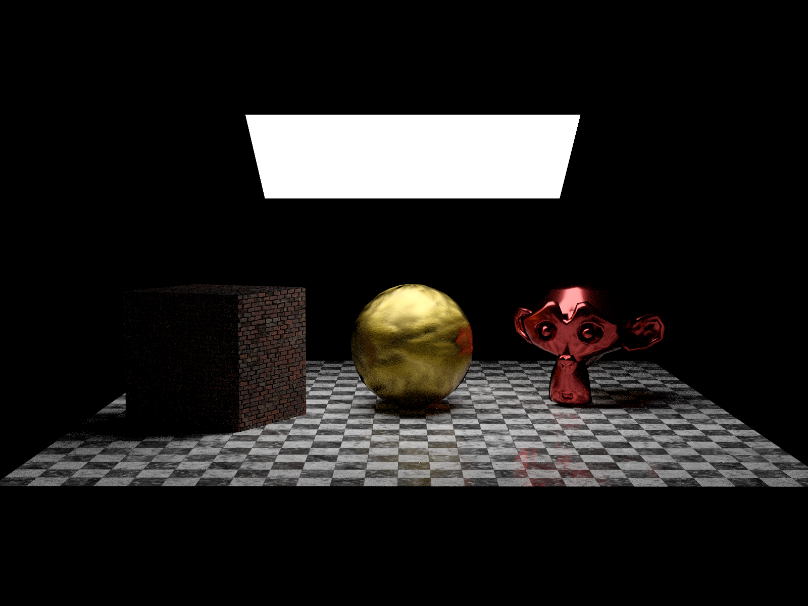
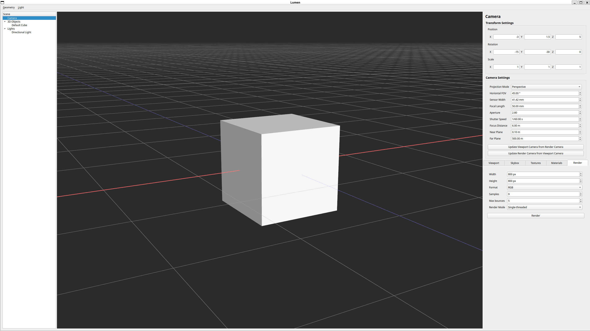
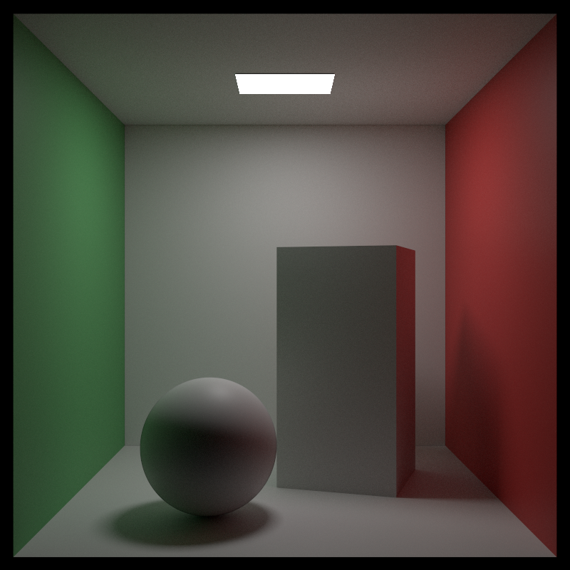
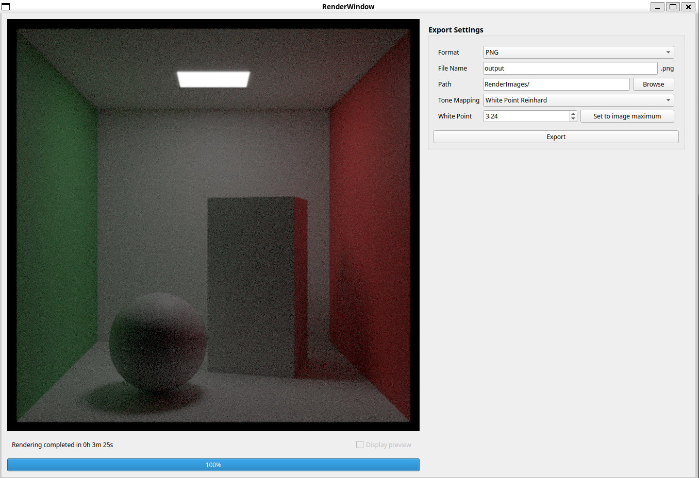

# Lumen

Lumen is a modern C++20 3D rendering engine built from scratch, designed to explore both real-time and offline rendering. It features a physically-based CPU path tracer with microfacet BRDFs (GGX), Multiple Importance Sampling, and BVH acceleration, alongside a real-time OpenGL viewport — demonstrating my amy skills in computer graphics and software engineering.








## ✨ Features

- **Texturing:** Supports albedo and normal mapping, with configurable wrapping (`REPEAT`, `MIRROR_REPEAT`, `CLAMP_TO_EDGE`, `CLAMP_TO_BORDER`) and filtering (`BILINEAR`, `NEAREST`) modes
- **Modular Architecture:** Clean separation of concerns across different modules
- **Mesh Generation & Loading:** Procedural generation of cubes, spheres, and planes, along with OBJ file loading capabilities
- **Advanced Lighting:** Implements directional, point, and spot lights with customizable parameters
- **Camera System:** Configurable camera with aperture, focus distance, field of view, and transformation controls
- **OpenGL Rendering View:** Real-time viewport with support for lights, shadows, tone mapping, gamma correction, textured materials, and skybox rendering  
- **Qt User Interface**: Developed a full-featured user interface using Qt and Qt Designer (`.ui` files), allowing dynamic control and inspection of all scene elements  
- **Skybox Integration:** Supports environment mapping using skybox textures
- **Image Exporting:** Renders can be exported as PNG, JPEG, BMP, TGA and HDR images with tone mapping and exposure adjustments
- **Tone Mapping**: Multiple tone mapping operators including `Exposure`, `Reinhard`, `ACES`, and `Uncharted2`
- **Physically-Based CPU Renderer**: Custom path tracer implemented on CPU, supporting both single-threaded and multi-threaded modes. Features GGX microfacet distribution, Multiple Importance Sampling (MIS), Russian Roulette termination  
- **Ray Acceleration:** Ray traversal acceleration with a *Bounding Volume Hierarchy* (BVH)
- **Comprehensive CI:** Automated formatting, linting and testing via GitHub Actions

## 🧩 Architecture Overview

The project is structured into distinct modules to ensure maintainability and scalability:

- **Core:** Fundamental utilities and data structures
- **BVH** : Manages the BVH construction
- **Surface:** Manages materials and textures
- **Geometry:** Responsible for mesh creation and loading
- **Lighting:** Defines different light types and their behaviors
- **SceneObjects** : Manages objects of the scene such as 3D Objects and Camera
- **Scene:** Manages the Scene and the Skybox.
- **Rendering:** Handles the rendering pipeline and settings
- **OpenGL:** Manages the real-time rendering view, shaders, framebuffers, and OpenGL-specific resources  
- **GUI**: Implements the user interface and interaction logic using Qt and Qt Designer (.ui files), enabling intuitive control and visualization of scene components.
- **Export:** Manages the export of rendered images

This modular design facilitates independent development and testing of each component.

## 📚 Documentation

The project is available with a Doxygen documentation. The documentation has been deployed with GitHub Pages and is accessible from this link : [https://lucas-gtr.github.io/Lumen/](https://lucas-gtr.github.io/Lumen/).

It includes detailed class references and module overviews.

## 🖼️ Rendering Pipeline

- **Ray Sampling**: Monte Carlo path tracing with stratified sampling per pixel, ensuring uniform stochastic coverage and improved convergence with reduced noise
- **Configurable Sampling**: The number of samples per pixel is fully configurable, allowing a balance between image quality and rendering time
- **Light Transport**: Supports direct and indirect lighting via global illumination. Paths are traced recursively with Russian Roulette termination to optimize performance without bias
- **BRDF Sampling**: Uses importance sampling of the GGX microfacet distribution, combined with Multiple Importance Sampling (MIS) for efficient and realistic light integration
- **Color Accuracy & Tone Mapping**: All shading is performed in linear space. Final output undergoes gamma correction and tone mapping using operators such as `Exposure`, `Reinhard`, `ACES`, and `Uncharted2`

## 🛠️ Build & Run Instructions

### Prerequisites

- C++20 compatible compiler (e.g., GCC 10+, Clang 11+, MSVC 2019+)
- CMake 3.10 or higher
- OpenGL 3.3 or higher
- Qt 6.x with the following modules:
  - `QtWidgets`
  - `QtOpenGLWidgets`

### Building the Project

```bash
git clone --recurse-submodules https://github.com/lucas-gtr/Lumen.git
cd Lumen
mkdir build && cd build
cmake ..
make
```

### Optional Build Flags
- `ENABLE_COMPILE_WARNINGS`: Enable compiler warnings (default: ON)
- `ENABLE_SANITIZERS`: Enable address and undefined behavior sanitizers (default: ON)
- `ENABLE_COMPILER_OPTIMIZATIONS`: Enable compiler optimizations (default: ON)
- `ENABLE_LTO`: Enable Link Time Optimization (default: OFF)
- `ENABLE_CLANG_FORMAT`: Enable code formatting checks (default: OFF)
- `ENABLE_CLANG_TIDY`: Enable static analysis checks (default: OFF)
- `ENABLE_DOXYGEN`: Generate documentation using Doxygen (default: OFF)
- `ENABLE_TESTS`: Build and run unit tests (default: OFF)

### Running the Application
```bash
make run
```

This command will simply launches the Qt application.  
From the graphical interface, you can then:
- Create various meshes (cube, sphere, plane)
- Load OBJ models
- Add and customize directional, point, and spot lights
- Set up materials with diffuse and emissive textures, normal maps, emissive strength, roughness and metalness
- Configure a camera with aperture, focus distance, and field of view
- Adjust tone mapping, exposure, and post-processing settings in real-time
- Trigger a path-traced render (single- or multi-threaded) and export the image

## ✅ Continuous Integration
The project employs GitHub Actions for continuous integration, ensuring code quality and reliability through automated workflows:

- Formatting & Linting: Utilizes clang-format and clang-tidy to enforce code style and detect potential issues.
- Testing: Runs unit tests using GoogleTest to validate functionality.

These workflows are triggered on pull requests to the `main` branch, maintaining code integrity and facilitating collaborative development.

### 🧪 Testing & Coverage
Unit tests are located in the tests/ directory and can be executed as follows:

```bash
make run-tests
```

To generate a coverage report:

```bash
make coverage
```

## Commands

These are the available Make targets:

| Command               | Description                                                                 |
|-----------------------|-----------------------------------------------------------------------------|
| `make run`            | Build and run the Lumen application                                         |
| `make build`          | Build the project if configured                                             |
| `make configure`      | Configure the main development build environment                            |
| `make format`         | Run clang-format over the entire codebase                                   |
| `make lint`           | Run static analysis using clang-tidy                                        |
| `make format-and-lint`| Run both clang-format and clang-tidy checks                                 |
| `make configure-tests`| Set up the build environment for unit tests                                 |
| `make run-tests`      | Build and run the test suite using GoogleTest                               |
| `make coverage`       | Generate a coverage report using gcovr (HTML and JSON output)               |
| `make update-readme`  | Inject the latest coverage report into the README.md                        |
| `make generate-doc`   | Generate Doxygen documentation into `docs/html`                             |
| `make clean`          | Remove all build directories and clean temporary artifacts

## 🚧 Future Improvements

Planned enhancements for future development:

- **Next Event Estimation (NEE)**: Improve light transport efficiency by explicitly sampling direct illumination from light sources at each bounce.
- **Real-Time Viewport Enhancements**: Add support for post-processing effects such as Bloom, Fog, and Screen Space Ambient Occlusion (SSAO) to enhance visual realism.
- **Deferred Shading Pipeline**: Introduce a deferred renderer to decouple geometry pass from lighting calculations, allowing efficient rendering of complex scenes with many lights.
- **glTF Support**: Implement a glTF 2.0 parser for loading entire scenes.
- **GPU Acceleration with CUDA**: Port the path tracer to CUDA to significantly reduce render times and enable real-time or near real-time feedback for high-quality previews.

## 🙋 About me

I'm a software engineer specializing in 3D development and modern C++ practices. Lumen is a testament to my passion for graphics programming and clean software architecture

📧 Contact me at: l_gottar@orange.fr

🔗 Connect with me on [LinkedIn](https://www.linkedin.com/in/lucas-gottar-856070234/)

## 📸 Gallery

**Default scene when starting the application**


**Export window to visualize and export the rendering**




